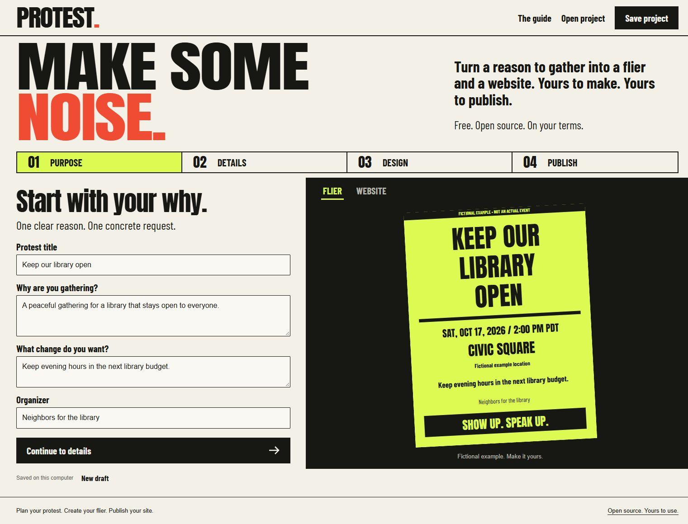

# PROTEST.

**Make some noise. Give people somewhere to show up.**

Protest turns a few event details into a printable flier, social images, a calendar invitation, and a website on your own GitHub Pages account. Run it on your computer. Keep your draft there. Review exactly what will be public before you publish.



Free software under the [MIT license](LICENSE). No Protest account, subscription, custom domain, or service operated by us.

## Start here

Download the Windows portable ZIP from [Releases](https://github.com/agammann/protest/releases), extract the entire folder, then double click **Start Protest.cmd**. Keep its terminal window open while you work. The app normally opens at `http://127.0.0.1:4317`. If that port is occupied, it opens an available local port automatically.

1. **Purpose:** explain why you are gathering, the concrete change you want, and who is organizing.
2. **Details:** add the date, time zone, full address, exact meeting point, accessibility information, and what participants should expect.
3. **Design:** choose a poster palette and download a Letter or A4 PDF, SVG, square image, or story image.
4. **Publish:** sign into GitHub, choose a site name, review the public files, and approve publication. Protest verifies that the live page contains the published revision before adding its QR code to your downloaded flier.

The first draft is explicitly marked as fictional. Choose **New draft** to create a real event. Use **Save project** to back up your draft before replacing it; the backup includes private planning notes.

See a [live fictional demonstration](https://agammann.github.io/protest-example/) showing a cancellation notice. No actual event is advertised.

Read [the organizing guide](docs/GUIDE.md), [privacy and security](SECURITY.md), and [verification notes](docs/VERIFICATION.md).

## What you get

* A bold poster with the date, time zone, venue, address, request, and organizer.
* A responsive event page with directions, public updates, source links, access information, downloads, calendar, and shareable images.
* A stable GitHub Pages URL for the QR code. Updates and cancellation notices use that same address.
* Local planning notes and a practical preparation checklist.
* Optional local MCP tools and read only WebMCP tools on the generated public page.

No attendance tracking, analytics, mailing list, payment, or hosted database is included. GitHub supplies hosting and imposes its own account requirements, terms, and [Pages limits](https://docs.github.com/en/pages/getting-started-with-github-pages/github-pages-limits). Public repositories support Pages on GitHub Free. The software cannot guarantee anonymity, event turnout, or continuing hosting availability.

## Run from source

Requires Node.js 22 or newer, pnpm 10, and [GitHub CLI](https://cli.github.com/) for publication. Windows, macOS, and Linux source use is supported by the code; see verification notes for what has actually been tested.

```sh
pnpm install --frozen-lockfile
pnpm build
pnpm start
```

For checks: `pnpm check` and `pnpm test`. Format source with `pnpm exec prettier --write "src/*.mjs" "ui/*.{ts,tsx,css}" "test/*.mjs" "scripts/*.mjs"`. `pnpm dev` runs the local server against the latest built frontend; rebuild after UI changes. Drafts live in `.protest/`. Set `PROTEST_DATA_DIR` to move them, `PROTEST_PORT` to change the port, or `PROTEST_GH_PATH` to select a GitHub CLI executable.

## Optional MCP

Configure a local MCP client with the following, replacing paths with your installation paths:

```json
{
  "mcpServers": {
    "protest": {
      "command": "node",
      "args": ["/absolute/path/to/protest/src/mcp.mjs"],
      "env": { "PROTEST_DATA_DIR": "/absolute/path/to/protest/.protest" }
    }
  }
}
```

Windows portable users can point `command` to the bundled `node.exe`. Tools: `get_protest`, `create_protest`, `update_protest`, `check_protest`, `export_materials`, `prepare_publication`. They work locally. Publication requires review in the editor. Avoid simultaneous edits from an MCP client and the browser; both work on the same draft.

Generated sites also register `get_protest_details` and `get_participant_instructions` when the browser exposes `document.modelContext`. Browser support is experimental; ordinary site navigation works without it. See the actual implementation in [render.mjs](src/render.mjs).

## Contribute

Open an issue or pull request with a concrete problem and steps to reproduce. Use fictional events and locations in tests. Preserve the single publishing path through an organizer's own GitHub account. Never commit `.protest/`, credentials, or private project backups.

Design inspiration: poster hierarchy from [Amplifier](https://amplifier.org/), concrete action from [Patagonia Action Works](https://www.patagonia.com/actionworks/), and source oriented publication from [WikiLeaks](https://wikileaks.org/). Protest is independent of these organizations and uses original layouts and bundled open font assets.
