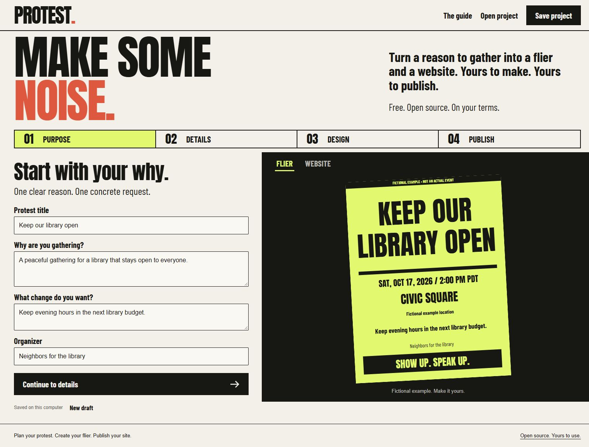

# PROTEST.

**Make some noise. Give people somewhere to show up.**

Protest turns event details into a printable flier, social images, a calendar invitation, and an event website on your own GitHub Pages account. Run the editor on your computer, save your draft there, and review the public files before publishing.



Free software under the [MIT license](LICENSE). No Protest account, subscription, custom domain, or hosted backend is required. Publication uses your own GitHub account.

## Start on Windows

Download `Protest-1.0.0-windows-x64.zip` and `SHA256SUMS` from [Releases](https://github.com/agammann/protest/releases/tag/v1.0.0). Check the ZIP's SHA256 against its line in that file:

```powershell
Get-FileHash .\Protest-1.0.0-windows-x64.zip -Algorithm SHA256
```

Extract the **whole folder**, then double click **Start Protest.cmd**. The Windows x64 package includes Node.js, GitHub CLI and production dependencies; it needs no separate Node.js installation. Keep its terminal window open while you work. The editor normally opens at `http://127.0.0.1:4317`; it chooses another local port if that port is occupied.

1. **Purpose:** explain why you are gathering, the change you want, and who is organizing.
2. **Details:** add the date, time zone, address, exact meeting point, accessibility information and expectations.
3. **Design:** choose a palette and download a Letter or A4 PDF, editable SVG, square PNG or story PNG.
4. **Publish:** connect GitHub, choose a site name, review the destination and public files, then approve publication.

The initial draft is explicitly fictional. **New draft** replaces it with a blank real-event draft. Wait for **Saved on this computer** before closing. Use **Save project** before replacing or moving your draft: that JSON backup includes your private notes.

For a first run, keep the fictional draft, edit its title, download an SVG, save the project, reload, then open the saved project. These steps work without GitHub or an internet connection after installation.

## Build from source

Requires Node.js **24 or newer** and **pnpm 11.19.0**. [GitHub CLI](https://cli.github.com/) is needed only to publish. Install pnpm if necessary with `npm install --global pnpm@11.19.0`.

Download `protest_1.0.0_source.zip`, verify its SHA256, and extract it. From the extracted project directory:

```sh
pnpm install --frozen-lockfile
pnpm check
pnpm build
pnpm start
```

Dependency installation requires internet access. Afterward, local editing and material exports work offline. `pnpm dev` also runs the local server against the built frontend; rebuild after UI changes.

Draft files live in `.protest/` beside the app. Set `PROTEST_DATA_DIR` to an absolute folder path to store them elsewhere, `PROTEST_PORT` to select a port, or `PROTEST_GH_PATH` to select a GitHub CLI executable. The server binds only to `127.0.0.1`.

## Publish and update

The Publish screen signs into GitHub through GitHub CLI's browser flow. Protest creates a public repository in the connected account and enables GitHub Pages. GitHub account eligibility, permissions, terms and [Pages limits](https://docs.github.com/en/pages/getting-started-with-github-pages/github-pages-limits) apply.

Review the account, repository, public details and file list before approving. Private notes, preparation checks and project backups are excluded from publication. Wait for **Your voice is live**: the app checks the expected page revision before enabling QR-bearing downloads. A failed verification removes the QR code from newly downloaded materials until that revision is verified again.

Changes, postponement and cancellation use the same site address. Edit the event status and public update, then review and publish again. Printed materials and calendar imports do not automatically update. Previously downloaded materials and Git history retain their earlier content.

If publishing fails, keep the local draft, check your GitHub connection and Pages permissions, then review a new publication. The app refuses unrelated or private repositories; choose a different site name instead of trying to take one over. Current verification scope is in [verification notes](docs/VERIFICATION.md).

## Save, restore and upgrade

**Save project** downloads the full draft, including private notes. **Open project** imports it into the current workspace and replaces the current draft; save the current one first. Invalid imports leave the saved draft intact.

For an upgrade, save a project backup, stop the old app, extract the new release into a separate folder, start it and open that backup. Keep the old folder until you have checked your notes and exports. The saved project keeps its event ID and site name. If you need the existing publication verification state too, copy the whole `.protest/` folder while both app instances are stopped. [Detailed recovery](docs/STABILITY.md) covers custom data folders and damaged JSON.

## Optional assistant tools

For local MCP, replace these paths with your installation paths:

```json
{
  "mcpServers": {
    "protest": {
      "command": "node",
      "args": ["/absolute/path/to/protest/src/mcp.mjs"],
      "env": { "PROTEST_DATA_DIR": "/absolute/path/to/protest/.protest" }
    }
  }
}
```

Windows portable users can use the included `node.exe` as `command`. The six local tools are `get_protest`, `create_protest`, `update_protest`, `check_protest`, `export_materials` and `prepare_publication`. They do not upload. Publication requires review in the editor. Avoid simultaneous browser and MCP edits to the same draft.

Generated public sites register two read-only WebMCP tools, `get_protest_details` and `get_participant_instructions`, when supported by the browser. They expose only the public event data. Browser support is experimental; ordinary site navigation and downloads work without WebMCP.

## Develop and contribute

- `src/project.mjs`: versioned draft schema, validation, readiness and public-field filtering.
- `src/render.mjs`: SVG/PDF/PNG/calendar/site generation and public WebMCP tools.
- `src/store.mjs`: queued atomic local writes.
- `src/server.mjs`: loopback editor API; `src/github.mjs`: reviewed publication.
- `src/mcp.mjs`: local assistant tools; `ui/`: React editor.

Run `pnpm check`, `pnpm test` and `pnpm build` for source checks. Browser checks use Playwright:

```sh
pnpm exec playwright install chromium
pnpm test:e2e
pnpm exec playwright install chrome
pnpm test:webmcp
```

`PROTEST_BROWSER_EXECUTABLE` can select a Chrome executable for browser checks. Native checks require a browser with WebMCP testing support and fail when the API is missing. They serve a newly generated fictional page locally. Publication tests use controlled GitHub responses; they do not create a live GitHub deployment.

`pnpm security:audit` prints the full dependency audit. `pnpm package:source` requires a clean committed tree. On Windows x64, follow it with `pnpm package` and set `PROTEST_GH_PATH` to an official GitHub CLI executable to build the portable package. Release CI verifies fresh source and portable extractions before publishing both packages.

Use fictional events and locations for tests. Preserve the public/private boundary and the single reviewed publishing path through an organizer's account. Never commit `.protest/`, credentials or private backups. Read [the organizing guide](docs/GUIDE.md), [privacy and security](SECURITY.md), [stability contract](docs/STABILITY.md), and [third-party notices](THIRD_PARTY_NOTICES.md).

There is no attendance tracking, mailing list, payment or analytics. Drafts are unencrypted local files. The software cannot guarantee anonymity, turnout, factual accuracy, hosting availability or physical print quality. Design inspiration comes from [Amplifier](https://amplifier.org/), [Patagonia Action Works](https://www.patagonia.com/actionworks/) and [WikiLeaks](https://wikileaks.org/); Protest is independent of them and uses original layouts and bundled open fonts.

